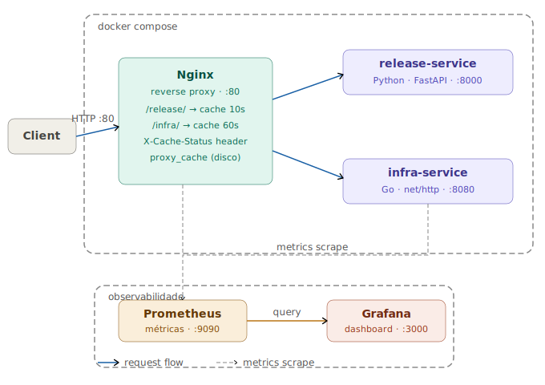
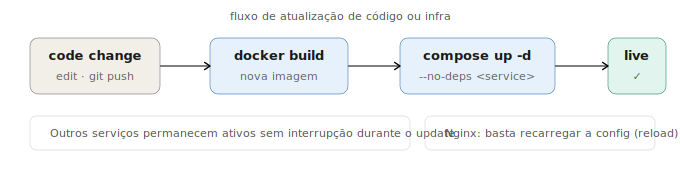

#  Two microservices with HTTP cache, observability and one-command startup

---

## Quick Start

```bash
docker compose up --build
```

| Serviço | URL |
|---|---|
| release-service | http://localhost/release/ |
| infra-service | http://localhost/infra/ |
| Grafana | http://localhost:3000 |
| Prometheus | http://localhost:9090 |

```bash
# Demonstrar o cache ao vivo
bash demo.sh
```

---

## Requisitos atendidos

| Requisito | Solução |
|---|---|
| Duas aplicações em linguagens diferentes | Python (FastAPI) + Go (net/http) |
| Rota retornando texto fixo | `GET /release/` e `GET /infra/` |
| Rota retornando horário do servidor | `GET /release/time` e `GET /infra/time` |
| Cache com tempos diferentes | Nginx proxy_cache — release 10s, infra 60s |
| Cache **no proxy, não na aplicação** | `proxy_cache` no Nginx — apps não têm lógica de cache |
| Fácil de iniciar | `docker compose up --build` — um único comando |
| Observabilidade | Prometheus + Grafana provisionados automaticamente |
| Diagrama de arquitetura | `docs/architecture.svg` |
| Fluxo de atualização | `docs/update-flow.svg` |
| Pontos de melhoria | Seção dedicada no README |
| Boas práticas Git | Conventional Commits, .gitignore, histórico limpo |

---

---

## Índice

- [Visão geral](#visão-geral)
- [Tecnologias e decisões](#tecnologias-e-decisões)
- [Estrutura do projeto](#estrutura-do-projeto)
- [Como executar](#como-executar)
- [Endpoints disponíveis](#endpoints-disponíveis)
- [Testando o cache — passo a passo](#testando-o-cache--passo-a-passo)
- [Observabilidade](#observabilidade)
- [Fluxo de atualização](#fluxo-de-atualização)
- [Dificuldades encontradas](#dificuldades-encontradas)
- [Pontos de melhoria](#pontos-de-melhoria)

---

## Visão geral

O projeto consiste em duas aplicações com domínios distintos de uma plataforma DevOps fictícia:

- **release-service** — simula um serviço de informações de deploy, retornando versão, ambiente e status de um release
- **infra-service** — simula um serviço de health check de infraestrutura, retornando o status de componentes como Nginx, Redis e Kubernetes

Na frente das duas aplicações há um **Nginx** atuando como reverse proxy com cache HTTP. Todo o tráfego passa obrigatoriamente pelo Nginx — as aplicações não expõem portas diretamente.

Para observabilidade, o **Prometheus** coleta métricas das aplicações e o **Grafana** as exibe em dashboard.

---

## Tecnologias e decisões

### Por que Python (FastAPI) no release-service?

FastAPI é o framework Python mais adotado em ambientes cloud-native modernos. É assíncrono, gera documentação automática via OpenAPI e tem performance superior ao Flask. A alternativa seria Django REST Framework, mas é muito mais pesado para uma API simples.

**Alternativas consideradas:** Flask, Django REST, Bottle
**Escolha:** FastAPI — melhor equilíbrio entre produtividade e performance

### Por que Go (net/http) no infra-service?

Go compila para um binário estático, o que permite um Dockerfile com **multi-stage build**: a imagem final contém apenas o binário sem nenhum runtime adicional. Isso resulta em imagem significativamente menor e com menor superfície de ataque. Além disso, Go é a linguagem nativa do ecossistema cloud-native — Docker, Kubernetes e o próprio Prometheus são escritos em Go.

**Alternativas consideradas:** Node.js (Express), Rust, Java (Spring Boot)
**Escolha:** Go — binário estático, multi-stage build, imagem mínima, linguagem cloud-native

### Por que Nginx para cache e não Redis?

O cache via `proxy_cache` do Nginx opera na **camada HTTP**, completamente transparente para as aplicações. Não exige nenhuma lógica de cache no código das apps — elas simplesmente respondem normalmente e o Nginx decide se serve do cache ou não.

Redis seria mais adequado se as aplicações precisassem de cache compartilhado entre múltiplas instâncias com lógica de negócio, como sessões de usuário ou resultados de queries complexas. Para cache de respostas HTTP, Nginx é a escolha correta e mais simples.

**Alternativas consideradas:** Redis, Memcached, cache na própria aplicação
**Escolha:** Nginx proxy_cache — sem dependência nas apps, padrão de mercado para cache HTTP

### Por que Docker Compose e não Kubernetes?

Docker Compose é a ferramenta correta para o escopo desse projeto. Kubernetes seria over-engineering — adiciona complexidade operacional (ingress, services, deployments, namespaces, RBAC) sem nenhum benefício real em ambiente de desenvolvimento ou demonstração. O requisito era facilidade de execução com o menor número de comandos possível.

**Alternativas consideradas:** Kubernetes (minikube/kind), Docker Swarm
**Escolha:** Docker Compose — um único comando sobe toda a infraestrutura

### Por que Prometheus + Grafana?

São o padrão de mercado para observabilidade em ambientes cloud-native. Prometheus usa um modelo pull-based, onde ele vai buscar as métricas nos serviços em intervalos configuráveis. Grafana consome essas métricas e exibe em dashboards. A dupla é usada em produção pela grande maioria das empresas que operam com containers.

**Alternativas consideradas:** Datadog, New Relic, ELK Stack, Zabbix
**Escolha:** Prometheus + Grafana — open source, padrão cloud-native, sem custo

---

## Estrutura do projeto

```
devops-challenge-2025/
├── release-service/
│   ├── main.py               # Aplicação Python com FastAPI e métricas
│   ├── requirements.txt      # Dependências Python
│   └── Dockerfile            # Build da imagem
├── infra-service/
│   ├── main.go               # Aplicação Go com métricas manuais
│   ├── go.mod                # Módulo Go
│   └── Dockerfile            # Multi-stage build
├── nginx/
│   └── nginx.conf            # Reverse proxy com proxy_cache
├── observability/
│   ├── prometheus.yml        # Configuração de scrape
│   └── grafana/
│       └── provisioning/
│           ├── datasources/
│           │   └── prometheus.yml    # Datasource provisionado automaticamente
│           └── dashboards/
│               ├── dashboard.yml     # Provider de dashboards
│               └── devops-challenge.json  # Dashboard provisionado
├── docs/
│   ├── architecture.svg      # Diagrama de arquitetura
│   └── update-flow.svg       # Diagrama de fluxo de atualização
├── demo.sh                   # Script de demonstração do cache
├── docker-compose.yml        # Orquestração de todos os serviços
└── README.md
```

---

## Como executar

### Pré-requisitos

- [Docker Desktop](https://docs.docker.com/get-docker/) instalado e rodando

### Subir toda a infraestrutura

```bash
docker compose up --build
```

Esse único comando faz o build das imagens, sobe o Nginx com cache configurado, o Prometheus e o Grafana com datasource e dashboard já provisionados automaticamente.

### Verificar se está tudo rodando

```bash
curl http://localhost/release/
curl http://localhost/infra/
```

Ambos devem retornar JSON com status 200.

### Parar

```bash
docker compose down
```

---

## Endpoints disponíveis

Todos os requests passam pelo **Nginx na porta 80**, que aplica o cache antes de rotear.

### release-service (Python · FastAPI · cache 10s)

| Rota | Descrição |
|---|---|
| `GET /release/` | Informações do último release |
| `GET /release/time` | Timestamp do último deploy |
| `GET /release/metrics` | Métricas Prometheus |

Exemplo — `GET /release/`:
```json
{
  "service": "release-service",
  "version": "1.4.2",
  "environment": "production",
  "status": "healthy"
}
```

Exemplo — `GET /release/time`:
```json
{
  "last_deployed_at": "2025-04-08T12:00:00.000000+00:00"
}
```

### infra-service (Go · net/http · cache 60s)

| Rota | Descrição |
|---|---|
| `GET /infra/` | Status dos componentes de infra |
| `GET /infra/time` | Horário atual do servidor |
| `GET /infra/metrics` | Métricas Prometheus |

Exemplo — `GET /infra/`:
```json
{
  "nginx": "healthy",
  "redis": "healthy",
  "kubernetes": "healthy",
  "status": "all systems operational"
}
```

---

## Testando o cache — passo a passo

### Execução do script de demonstração

```bash
bash demo.sh
```

### O que acontece em cada etapa

**Etapa 1 — release-service, 1ª chamada**
```
X-Cache-Status: MISS
```
O Nginx não tem a resposta em cache. Ele encaminhou o request para o release-service, recebeu a resposta, armazenou no cache e respondeu ao cliente. A aplicação foi acionada.

**Etapa 2 — release-service, 2ª chamada imediata**
```
X-Cache-Status: HIT
```
O Nginx encontrou a resposta no cache e a serviu diretamente, sem acionar a aplicação. O release-service não recebeu nenhum request. Isso é o cache funcionando.

**Etapa 3 — infra-service, 1ª chamada**
```
X-Cache-Status: MISS
```
Mesmo comportamento — primeiro request sempre é MISS, Nginx armazena no cache com TTL de 60 segundos.

**Etapa 4 — infra-service, 2ª chamada imediata**
```
X-Cache-Status: HIT
```
Nginx serve do cache. infra-service não é acionado.

**Etapa 5 — Aguarda 11 segundos**

O script espera 11 segundos. O cache do release-service tem TTL de 10 segundos — portanto já expirou. O cache do infra-service tem TTL de 60 segundos — ainda está válido.

**Etapa 6 — release-service após expiração**
```
X-Cache-Status: EXPIRED
```
Cache expirou. Nginx buscou versão atualizada no release-service e renovou o cache por mais 10 segundos.

**Etapa 7 — infra-service ainda em cache**
```
X-Cache-Status: HIT
```
Cache de 60 segundos ainda válido. Isso demonstra que cada serviço tem seu próprio tempo de expiração independente — release expira em 10s enquanto infra ainda está cacheado.

### Testando manualmente via curl

```bash
# Primeira chamada — MISS
curl -si http://localhost/release/ | grep X-Cache-Status

# Segunda chamada imediata — HIT
curl -si http://localhost/release/ | grep X-Cache-Status

# Chamadas consecutivas para ver MISS e HIT na mesma linha
curl -si http://localhost/release/ && curl -si http://localhost/release/ | grep X-Cache-Status
```

### Verificando as métricas diretamente

```bash
# Gera requests para popular as métricas
curl http://localhost/infra/
curl http://localhost/infra/time
curl http://localhost/infra/

# Verifica os contadores
curl http://localhost/infra/metrics
```

Saída esperada:
```
# HELP infra_requests_total Total de requests
# TYPE infra_requests_total counter
infra_requests_total{endpoint="/"} 3
infra_requests_total{endpoint="/time"} 1
```

---

## Observabilidade

| Serviço | URL | Credenciais |
|---|---|---|
| Grafana | http://localhost:3000 | admin / admin |
| Prometheus | http://localhost:9090 | — |

O datasource do Prometheus e o dashboard do Grafana são provisionados automaticamente via arquivos de configuração — não é necessária nenhuma configuração manual na interface.

### Consultando métricas no Prometheus

Acesse `http://localhost:9090` e execute as queries:

```
# Serviços ativos (1 = up, 0 = down)
up

# Total de requests no infra-service por endpoint
infra_requests_total

# Taxa de requests por minuto
rate(infra_requests_total[1m])

# Duração dos scrapes
scrape_duration_seconds
```

### Dashboard no Grafana

O dashboard **DevOps Challenge 2025** é carregado automaticamente e exibe:

- Gráfico de requests por endpoint do infra-service em tempo real
- Status de serviços monitorados (UP/DOWN)
- Duração dos scrapes do Prometheus

---

## Arquitetura



### Fluxo de request

1. Cliente faz request HTTP na porta 80
2. Nginx verifica se há resposta em cache para aquela rota
3. **Cache HIT** → Nginx responde direto, aplicação não é acionada
4. **Cache MISS** → Nginx roteia para a aplicação, armazena a resposta em cache, responde ao cliente
5. Header `X-Cache-Status` em toda resposta indica o resultado: `HIT`, `MISS` ou `EXPIRED`

---

## Fluxo de atualização



### Atualizar uma aplicação sem derrubar os outros serviços

```bash
docker compose build release-service
docker compose up -d --no-deps release-service
```

O flag `--no-deps` garante que apenas o serviço especificado seja reiniciado. Nginx, infra-service, Prometheus e Grafana continuam rodando sem interrupção.

### Atualizar configuração do Nginx sem downtime

```bash
docker compose exec nginx nginx -s reload
```

### Atualizar configuração do Prometheus

```bash
docker compose restart prometheus
```

---

## Dificuldades encontradas

### 1. Permissão no diretório de cache do Nginx

O Nginx tentava criar os diretórios `/tmp/cache/release` e `/tmp/cache/infra` na inicialização, mas o container não tinha permissão para criá-los automaticamente, resultando em erro `mkdir() failed (2: No such file or directory)`.

**Solução:** Adicionar um comando no `docker-compose.yml` que cria os diretórios antes de iniciar o Nginx:
```yaml
command: /bin/sh -c "mkdir -p /tmp/cache/release /tmp/cache/infra && nginx -g 'daemon off;'"
```

### 2. Dependência externa no Go sem go.sum

Ao adicionar métricas com a biblioteca oficial `prometheus/client_golang`, o build falhou porque o arquivo `go.sum` não estava no repositório. O Docker não consegue baixar dependências externas sem o arquivo de lock, e gerar o `go.sum` dentro do container durante o build não é uma prática recomendada.

**Solução:** Implementar as métricas manualmente no formato Prometheus (text exposition format), sem dependências externas. O Go padrão é suficiente para expor um endpoint `/metrics` compatível com qualquer scraper Prometheus:
```go
fmt.Fprintf(w, "# HELP infra_requests_total Total de requests\n")
fmt.Fprintf(w, "# TYPE infra_requests_total counter\n")
fmt.Fprintf(w, "infra_requests_total{endpoint=\"/\"} %d\n", count)
```

### 3. Roteamento do /metrics pelo Nginx com cache

As rotas `/release/metrics` e `/infra/metrics` estavam sendo capturadas pelas regras de cache genéricas, que esperavam respostas JSON com TTL configurado. O endpoint `/metrics` retorna `text/plain`, gerando conflito no cache.

**Solução:** Adicionar locations específicos para `/metrics` antes das regras de cache no `nginx.conf`, sem aplicar cache nessas rotas — métricas devem ser sempre frescas.

### 4. Persistência do Grafana entre reinicializações

Toda vez que os containers eram reiniciados, o Grafana perdia as configurações de datasource e dashboard feitas pela interface, exigindo reconfiguração manual a cada restart.

**Solução:** Provisionar o datasource e o dashboard via arquivos de configuração montados como volume no container:
```
observability/grafana/provisioning/datasources/prometheus.yml
observability/grafana/provisioning/dashboards/devops-challenge.json
```
Com o provisioning, o Grafana sobe sempre configurado, sem necessidade de intervenção manual.

### 5. Autenticação no GitHub via HTTPS no Windows

O Git Bash no Windows não conseguia autenticar via HTTPS — o GitHub removeu suporte a autenticação por senha em 2021 e exige Personal Access Token (PAT).

**Solução:** Gerar um PAT com escopo `repo` e usar o token na URL remota:
```bash
git remote set-url origin https://TOKEN@github.com/usuario/repositorio.git
```

---

## Pontos de melhoria

**CI/CD pipeline**
Automatizar build e deploy via GitHub Actions ao receber push na branch principal. O workflow faria build das imagens, rodaria testes e faria redeploy automático com `--no-deps`.

**Healthchecks no Docker Compose**
Garantir que o Nginx só suba após as aplicações estarem prontas:
```yaml
healthcheck:
  test: ["CMD", "curl", "-f", "http://localhost:8000/"]
  interval: 10s
  timeout: 5s
  retries: 3
```

**Métricas no release-service**
Adicionar contadores de requests e histograma de latência equivalentes aos do infra-service, expondo dados de ambos os serviços no dashboard do Grafana.

**HTTPS com TLS**
Adicionar certificado TLS no Nginx. Em produção, usar Let's Encrypt com certbot ou certificado gerenciado pelo provedor de cloud.

**Imagens base mais seguras**
Migrar para imagens `distroless` para reduzir vulnerabilidades. A imagem atual do Python 3.12-slim tem vulnerabilidades conhecidas identificadas pelo Docker Scout.

**Cache invalidation sob demanda**
Implementar invalidação via `ngx_cache_purge` para cenários onde uma atualização precisa ser refletida imediatamente, sem esperar o TTL expirar.

**Alertas no Grafana**
Configurar alertas para notificar quando algum serviço ficar indisponível (`up == 0`) ou quando a latência ultrapassar um threshold definido.

**Volumes persistentes para Prometheus**
Preservar histórico de métricas entre restarts:
```yaml
volumes:
  - prometheus_data:/prometheus
```